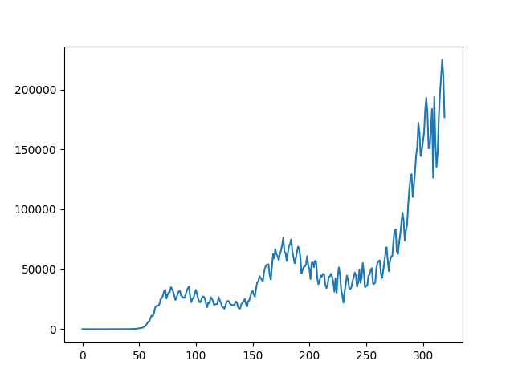

# CS451 final project

Use Twitter data (tweets) to predict case numbers for COVID-19.

## Data sources

The daily COVID-19 cases in the United States was obtained here:
https://www.kaggle.com/sudalairajkumar/covid19-in-usa

COVID-19 twitter data from July to August is from here:
https://www.kaggle.com/gpreda/covid19-tweets

COVID-19 twitter processed n-gram data from January 23 to November 1 is from here:
https://www.kaggle.com/paulrohan2020/covid19-unique-tweets

## Goal

Given twitter text data and number of new positive cases on a certain day, we want to forecast the number of new positive cases the next day. New cases are related to the previous day but may increase or decrease based on conditions on the ground e.g. lockdowns, quarantines, mask wearing. Tweets are a noisy signal of the true state of the world which we can leverage to estimate the number of cases tomorrow based on today.

## Methods

We treat each day as a datapoint, with the features being the unigrams of tweets occurring on this day, and the number of cases reported on this day. We then use this to predict the number of cases on the next day. We split the dataset by date so that the training data is the days prior to the split, and test data are the days after the split. Using a 4:1 split we got `Train 196, test 49, 80 percent split`, so the last 7 weeks were test data, while the model is trained on the first 28 weeks (over 6 months).

## Results

One problem with forecasting is that a model might be simply regressing the next day's value based on the current day, treating it as an AR(1) model. We know that this cannot simply be the case, and we can see that if we plot the number of cases against the number of cases on the next day.

### Baseline model

Let's build a baseline model to see what would happen if we built an AR(1) model using 1-dimensional linear regression ignoring any Twitter data.

We got RMSE = 18917 in one run.

On first glance it seems the AR(1) model performs fairly well. But you might notice that most predictions are very close to 90% of the ground truth. Looking at predicted vs current day cases, you see that the AR(1) model is really repeating numbers, not forecasting. The predicted value simply lags the observed values, nothing more. It does not solve the forecasting problem that our NLP models will try to solve.

### Feature selection

Our features are bag of words (frequencies) and current day case numbers, with the target being the next day's case numbers. If we include too many words in our features our model will tend to overfit. So we decided to use the top 200 scoring words based on their F-scores in F-Regression, which Scikit-Learn provides.

### Linear Regression

We have seen that the models we built should not be AR(1) models: they should be able to learn how frequently occurring words on Twitter relate to positive COVID-19 cases in the future. Here we do linear regression, which is fairly simple but surprisingly effective enough in many applications. Our approach is to use `mapPartitions` and generate a linear model on the data in each partition, then aggregate the models (average their prediction results) in an ensemble approach.

From the above we can see that the predicted number of cases has significant variation and is not strongly dependent on current day number of cases, though of course there must be some correlation.

We can check the accuracy of predictions made:

This shows that the predicted value does not line up with actual results nicely, but there is an observable trend, so the model predictions have some accuracy.

We would consider a prediction good if it is close to the ground truth, which would mean the ratio of predicted to actual should be close to 1. A histogram of ratios shows that.

We see that almost all of our predictions are within 50% of the ground truth, and a significant number is within 10%. For practical purposes, this could be very useful, if we are always able to predict within 50% of the number of cases the next day given just current day case numbers and information from Twitter.

From this chart we see that the predictions are no longer lagging the current day, rather the model is trying to better predict the next day's case numbers using word frequencies. However the predictions are not very accurate, as demonstrated by significant discrepancies.

### Random Forest

Next we want to take a random forest approach. Random forest uses bagging (bootstrap aggregation), meaning it resamples from the dataset and generates decision trees on the bootstrapped samples for ensemble learning. In our approach we use `mapPartitions` on top of this, generating a separate random forest model using `sklearn` in each partition, then aggregating their results in prediction.

Predicted vs actual

Predicted as ratio of ground truth

Trend

The random forest model appears to be biased against high case numbers. Since it was trained on USA case data, and the USA is hitting a new sudden spike in cases near the end of this dataset, the random forest models struggle to capture this pattern. It is expected that random forest models are poorer at extrapolation than other models. The random forest model performs very well on case numbers before the last two weeks' spike, and is not simply lagging the observed data, as it shows an ability to (at least sometimes) predict increases or decreases before they happen.

## Conclusions

It appears linear regression and random forest both have their strengths and weaknesses. In particular, random forest does poorly in predicting future data that is very different from observed trends, while linear regression generalizes and extrapolates better. Random forest is more accurate in predicting data that is similar to training data.

Both models have shown effectiveness, so we can consider our methods a limited success. The linear model for example predicted within 10% of the ground truth 20 out of 49 times on test data. The random forest model made every prediction within 40% of the ground truth.
